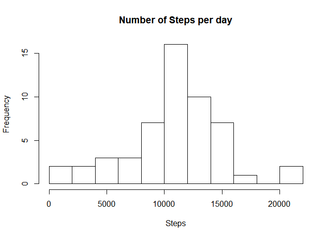
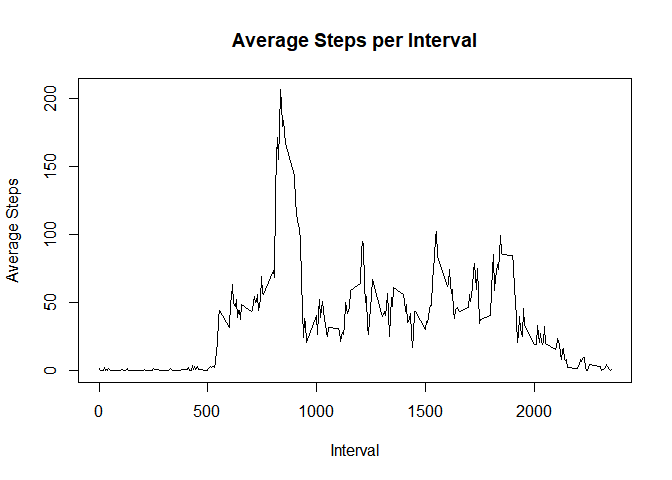
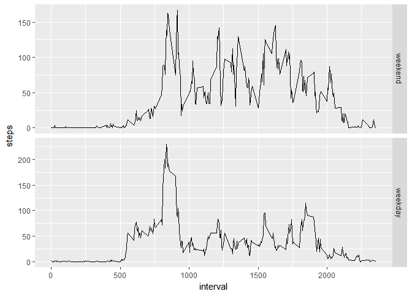

Mauricio Muniz


## Loading and preprocessing the data

First, the file has to be unzipped. After that, it will be loaded and stored as a data.table (library has to be loaded too).


```r
    library(data.table)
    unzip("activity.zip")
    stepsLog <- data.table(read.csv("activity.csv"))
```


## What is the mean total number of steps taken per day?

To answer this question, we make the histogram showing the frequency of the total number of steps taken per day.


```r
    dailySteps <- stepsLog[,sum(steps),by=date]
    names(dailySteps)[2] = "sumSteps"
    hist(dailySteps$sumSteps, breaks = 10, main = "Number of Steps per day", xlab = "Steps")
```

<!-- -->

Then we can calculate the mean:

```r
    mean(dailySteps$sumSteps, na.rm = TRUE)
```

```
## [1] 10766.19
```

And the median:

```r
    median(dailySteps$sumSteps, na.rm = TRUE)
```

```
## [1] 10765
```

## What is the average daily activity pattern?

The acticity pattern comes form averaging the number of steps grouped by the interval variable.


```r
    intervalSteps <- stepsLog[, mean(steps, na.rm = TRUE),by=interval]
    names(intervalSteps)[2] = "avgSteps"
    plot(intervalSteps$interval, intervalSteps$avgSteps, type = "l", 
         main = "Average Steps per Interval", xlab = "Interval", ylab = "Average Steps")
```

<!-- -->

With that information, one can check which of the intervals contain the maximum number of average steps


```r
    intervalSteps[which.max(intervalSteps$avgSteps),]
```

```
##    interval avgSteps
## 1:      835 206.1698
```

## Imputing missing values

The number of NAs in the dataset is:


```r
    sum(is.na(stepsLog))
```

```
## [1] 2304
```

To impute the missing values, I chose to replace them with the number of steps in that 5 minute interval averaged across all days (rounded to the nearest integer). The new dataset is then assigne to the 'imputed' variable.


```r
    stepsLog <- stepsLog[,groupavg:=mean(steps,na.rm=TRUE),by=interval]
    missing <- is.na(stepsLog$steps)
    imputed <- stepsLog
    imputed$steps <- as.numeric(imputed$steps)
    imputed[missing,1] <- round(imputed[missing,4])
```

The new histogram of the new dataset is shown below.


```r
    dailyImpSteps <- stepsLog[,sum(steps),by=date]
    names(dailyImpSteps)[2] = "sumSteps"
    hist(dailyImpSteps$sumSteps, breaks = 10, main = "Number of Steps per day", xlab = "Steps")
```

<!-- -->


Then we can calculate the new mean:

```r
    mean(dailyImpSteps$sumSteps, na.rm = TRUE)
```

```
## [1] 10766.19
```

And the new median:

```r
    median(dailyImpSteps$sumSteps, na.rm = TRUE)
```

```
## [1] 10765
```

We can see that the chosen imputting method did not change the mean/median pair.

## Are there differences in activity patterns between weekdays and weekends?

To separate the weekdays from weekends, first we have to identify the dates using the weekdays() function and then create a factor vector indicating whether a date is a weekend or not.


```r
    stepsDay <- weekdays(as.Date(imputed$date))
    #weekdays in portuguese
    stepsDay <- (stepsDay == "sábado" | stepsDay == "domingo")
    imputed[,weekend:=factor(stepsDay,c(TRUE,FALSE),c("weekend","weekday"))]
    weekendSteps <- imputed[,sum(steps),by=weekend]
```

Then we can make a panel plot showing the data as follows:


```r
    library(ggplot2)
    ggplot(data=imputed, aes(interval,steps))+stat_summary(fun.y=mean,geom="line")+
        facet_grid(weekend~.,scales="free_y")
```

<!-- -->


